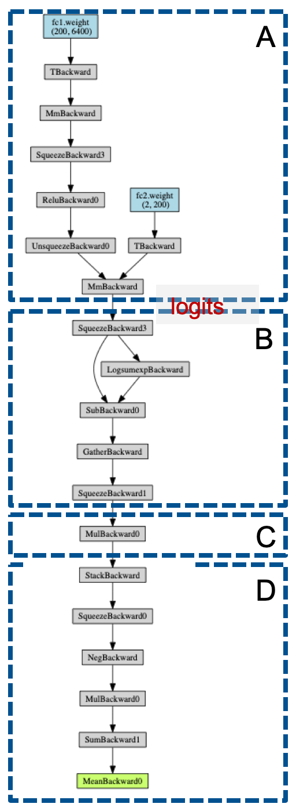
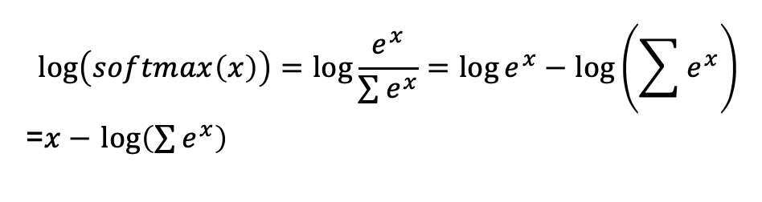

# dirty-rl
Learning from making mistakes implementing RL in PyTorch.
 
This repo contains RL code, but the value it brings, if any, stems from the PyTorch discussion that follows below. 
 
## Tips
Some tips and lessons from writing this code.

- Run the random policy and see how it behaves on your task.  
This will give you a baseline for detecting when your implementation is really 
learning, and when it only appears to be learning.
For example, a random policy controlling an Atari Pong game, looks like this:
[image]

-  Look at the output of the pre-processing.  
I messed up the pre-processing in various
ways, and that prevents all learning.  This is usually easy to catch and fix because 
this is a functional bug.  In a burst of wasted energy I wrote a decorator 
`utils.func_footer` which performs a specified action at the exit of the decorated 
function.  I decorated `pre_process_game_frame` so that every 500 input frames, the
pre-processed frame is displayed.  A simple `if` statement would suffice, but would require
an ugly global to count the number of times `pre_process_game_frame` was invoked.  The
extra complexity I introduced is not warranted, but it was fun.
    ```
    @func_footer(500, 
                 lambda processed_img: transforms.ToPILImage()(processed_img.cpu() / 255.).show())
    def pre_process_game_frame(I, n_channels, output_shape):
        ...
    ```

- Watch the game play by rendering the game frames.  
This is a sanity check: if the
 game is supposed to be random, look for random play.  If the agent arrives at a trivial
 solution, like always moving up, then you should see that.

- If rendering is too expensive, but you want to peak every once in a while and examine
how the agent plays, add interactive rendering: allow keyboard or file to toggle environment 
rendering.

- Add instrumentation.  
  Use TensorBoard to log and monitor interesting data like loss and 
episode rewards.  Returns are very noisy in RL from my experience, so use a smoothing 
function like an exponential-moving-average.

- Watch the action-policy entropy.  
  In DQN, we explicitly control the exploration using an epsilon-greedy schedule.  In VPG,
we add stochasticity by sampling an action from a `torch.Categorical` distribution.  We sample
once for each step in the rollout trajectory, and we use the same action-policy for several episodes,
so we can compute the entropy of this distribution.  We should expect to see high entropy (i.e. 
random-ish actions) at the beginning, which decays as the policy learns.

- Speaking of entropy, I followed John Schulman's [advice](https://www.youtube.com/watch?v=jmMsNQ2eug4)
 to maximize initial entropy by initializing the weights of the last linear layer (of only
 2 layers ;-) to zero. The effect on the initial entropy is clear and so is the effect on the 
 performance of the policy.  It's a nice phenomena to see.

## Follow dem gradients

- Let’s follow the gradients.  
Sometimes our model’s graph is not trivial.  The network is not learning,
or learned a bit and then got stuck in some very local minimum.  And you suspect that not all parameters are trained 
or updated.  Or maybe your backward graph has a temporal discontinuity - as I illustrate below in the case of PG. In 
any case, visualizing the backward graph is enlightening and can uncover bugs.     

    To create a visualization of the backward graph, I use the incredible little [torchviz](https://github.com/szagoruyko/pytorchviz)
 package. The discussion below on visualizing VPG backward graphs shows some example graph diagrams.
 You can also view the backward graph by using a debugger to break before or after `loss.backward()` and then use
  the variable-watch pane/tab to trace the graph.  Open the `loss` tensor and then the `grad_fn` variable.  This is the 
  root of the back-propagation graph.  Open `grad_fn`'s `next_functions` tuple variable.  For each member in the tuple,
  open it's `next_functions` variable, and continue doing so until you arrive at each of the parameter tensors.  You will
  know you are close, when you encounter the `AccumulateGrad` object - this the object responsible for updating the 
  parameter gradients (`param.grad`) accumulator using the gradients that flow from the `loss` root and down to this leaf.

<div style="text-align: center;"> </div>


- There are several ways to keep your eye on the values of your gradients: 
    - You can plot the weights and gradients distribution and histograms - look at the gradient sizes and ranges: 
     do they make sense?
     While debugging VPG I saw insanely large gradients - a definite red light. I also detected periods of no-learning
     (or very slow learning) by noticing that the weights kept the same distribution shape across a period of training;
    - You can access the parameter gradients directly and print their norms; 
    - You can register to callbacks on parameter updates and on operation backward or forward updates.  This gives
    you access to feature-maps (a.k.a. activations) gradients;
    - You can also access the feature-maps in the policy `forward` method.
    - Besides watching the gradients, I also put little traps for anomalous conditions like all-zero gradients. 
    This is not the case of vanishing gradients, but a case of all-zeros in the gradients.
    ```
        for name, param in q_behavior.named_parameters():
            if param.grad.data.abs().sum() == 0:
                debug = True  # Trap
    ```

## Visualizing VPG backprop graphs

As I explained above, visualizing the back-propagation graph can be instructive.  Here's a look at the graph of 
backward graph of a single policy step (i.e. one action, in one game).  To create this diagram, you invoke `vanilla-pg.py` with `--debug-diagram-steps=1`.  I’ve divide the graph into 4 subgraphs (A-D), so we can discuss each one separately.  

<div style="text-align: center;"> </div>

In subgraph A, we run the policy model and compute the logits: 
```
logits = policy(current_state)
```
In subgraph B, we sample an action from a Categorical distribution.  
```
torch.distributions.Categorical(logits=logits)
action = C.sample()
logprob = C.log_prob(action)
```
What’s happening here?  The PyTorch code is available [here]( https://github.com/pytorch/pytorch/blob/master/torch/distributions/categorical.py), but let’s break it down.  When we create an instance of ` torch.distributions.Categorical`, we can choose to pass it a tensor of probabilities or a tensor of logits.  I chose to pass a tensor of logits.  These logits will be used to assign a probability value to each category (discrete value) in our action distribution.
Turning logits into probabilities is something we do often in classification tasks, using the softmax function.  The constructor of ` torch.distributions.Categorical` computes the log-softmax of the logits and assigns this value back to the logits:
```
self.logits = logits - logits.logsumexp(dim=-1, keepdim=True)
```
If this line doesn’t make sense to you, think of taking the log(softmax(x)).  

<div style="text-align: center;"> </div>
We then sample an action and use a `gather` operation to choose the specific log-probability of the action we chose.

In subgraph C, we now need to choose a specific action to do the backprop on, so we mask the rest of the actions using a one-hot vector representing the action index.
Finally, in subgraph D, we compute the policy “loss”. 
```
policy_loss = (-batch_action_logp * discounted_epr).sum(dim=1).mean()
```

Now let’s look at what happens when we have two steps.
There is one very important nuance: while we are playing the game, collecting experience (i.e. rollout), we don’t have subgraph D yet, because that requires computing the discounted episode reward (i.e. the return), which hwe can only do after we are done rolling out the entire episode.

That means that we are collecting a bunch of subgraphs.  That is a lot of memory, and a lot of compute.
We then sample an action and use a `gather` operation to choose the specific log-probability of the action we chose.

In subgraph C, we now need to choose a specific action to do the backprop on, so we mask the rest of the actions using a one-hot vector representing the action index.
Finally, in subgraph D, we compute the policy “loss”. 
```
policy_loss = (-batch_action_logp * discounted_epr).sum(dim=1).mean()
```

Now let’s look at what happens when we have two steps:

<div style="text-align: center;"> </div>

There is one very important nuance: while we are playing the game, collecting experience (i.e. rollout), 
we don’t have subgraph D yet, because that requires computing the discounted episode reward (i.e. the return), 
which hwe can only do after we are done rolling out the entire episode.

! So what we have is a bunch of trees, all rooted at a `MulBackward` operation !

For me, seeing the graph below (3 game actions) brought the VPG mechanism to life.  When we stack masked 
`action_logprob` tensors in our memory, we are actually stacking a bunch of backprop trees - 
That is a lot of memory, and a lot of compute:

    memory.append(action_mask * action_logprob,
                  torch.tensor(reward),
                  action_prob.)

<div style="text-align: center;"> </div>

## All-zero gradients - what's that all about?
  - [Explain here how all-zero gradients can come to be]


## Multiprocess Vanilla Policy Gradients
In the MP version of VPG, several processes are launched to perform several episodes of experience rollouts.
As in single-process VPG, each process computes (using backprop) and accumulates the policy gradients using the experience memory.
we perform an `all_reduce` operation on the gradients.  This operation can be a `sum-all` or `mean` operation.
After the `all_reduce`, all processes are synchronized and have the same gradients.

Finally, each process can now update its weights using the gradients.  Because all processes started with the same weights,
and used the same gradients, all weights sets remain equal.

    reduce_gradients(policy, args.gradient_reduce, args.batch_size)
    optimizer.step()

The `all_reduce` operation seems wasteful since it uses full-mesh communication: each process sends
its gradients to all other processes (n * n-1 operations).  I tried improving it by doing a simple 
`reduce` operation on the master-node (rank 0), performing the backprop only on the master-node
(saves power), and then broadcasting the weights from the master-node to all other processes.

Because we only perform the backprop on the master-node, we should get better performance
(less data movement, compute and more cache-locality).
I didn't invest too much time in this, but it seems to help only a little.

    reduce_gradients(policy, args.gradient_reduce, args.batch_size)
    if rank == 0:
        optimizer.step()
    # Make sure that all processes pass this point only after the master-node
    # has completed the back-prop. 
    dist.barrier()
    # broadcast back the weights
    for param in policy.parameters():
        dist.broadcast(param.data, 0)


See also [PyTorch distributed communication](https://pytorch.org/tutorials/intermediate/dist_tuto.html#collective-communication)

For objects sharing state across process-boundaries (like the moving-average tracker) I used
multiprocessing.managers.BaseManager which uses proxies to access shared-state.  This is very
convenient, but a simple queue might be more efficient.  
See also [this](https://www.geeksforgeeks.org/multiprocessing-python-set-2/).


## OpenMP

"The OMP_NUM_THREADS environment variable sets the number of threads to use for parallel regions"
```
os.environ["OMP_NUM_THREADS"] = "1"os.environ["OMP_NUM_THREADS"] = "1"
```
- See the [OpenMP documentation](https://www.openmp.org/spec-html/5.0/openmpse50.htmlhttps://www.openmp.org/spec-html/5.0/openmpse50.html).
- This value must be set before importing `numpy`. 
- In [torch.distributed.launch](https://github.com/pytorch/pytorch/blob/master/torch/distributed/launch.py), processes 
are created using a provided environment, so there's no issue with import order.

```
process = subprocess.Popen(cmd, env=current_env)
```